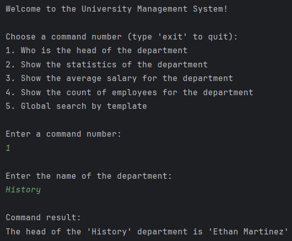
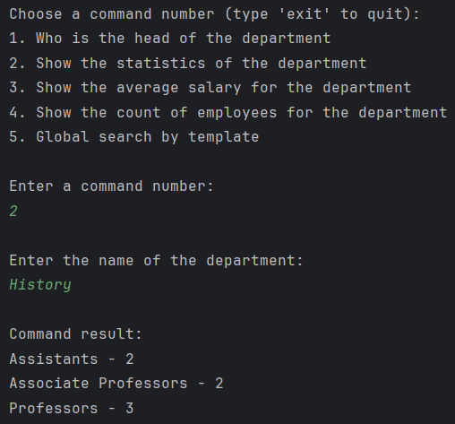
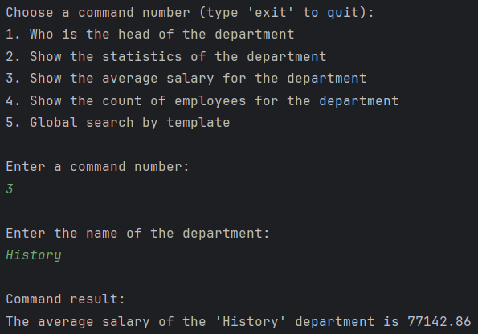
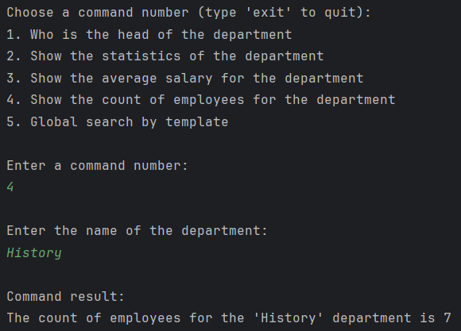
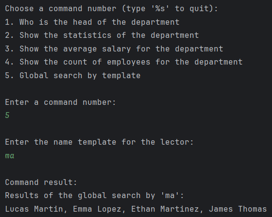
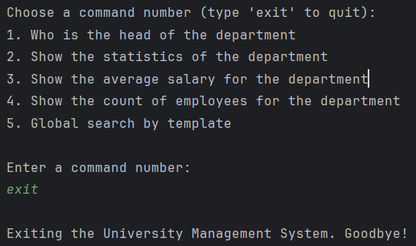

# University Management System

A Spring Boot application designed to manage university departments and lector information. It allows users to interact with various aspects of the university's departments, such as viewing department heads, statistics, average salaries, employee counts, and conducting global searches for lectors.

## Features

### 1. **Department Head Information**
- Retrieve the head of a specific department by name. The application prompts the user to enter a department name and returns the name of the department head (if available).
    

### 2. **Department Statistics**
- Get detailed statistics for a department, including counts of assistants, associate professors, and professors. The user inputs the department name, and the system displays the breakdown of faculty types.
    

### 3. **Department Average Salary**
- Calculate and display the average salary of all lectors within a department. This is done by computing the average of all lector salaries in the selected department.
    

### 4. **Department Employee Count**
- Count and display the total number of employees (lectors) in a department. This information is presented after the user inputs the department name.
    

### 5. **Global Lector Search**
- Perform a global search for lectors based on a name template. Users can enter a partial name, and the application will list all lectors whose names match the template.
    

### 6. **Exit Command**
- The application allows users to exit the program gracefully by entering an exit command.
    

## How It Works

Upon startup, the application prompts users with a menu of commands. The user can select a command by entering the corresponding number. For each command, the application will:

- Ask for the necessary input (e.g., department name or lector name template).
- Process the request and display the result.

The program will continue to display the menu and accept commands until the user decides to exit.
